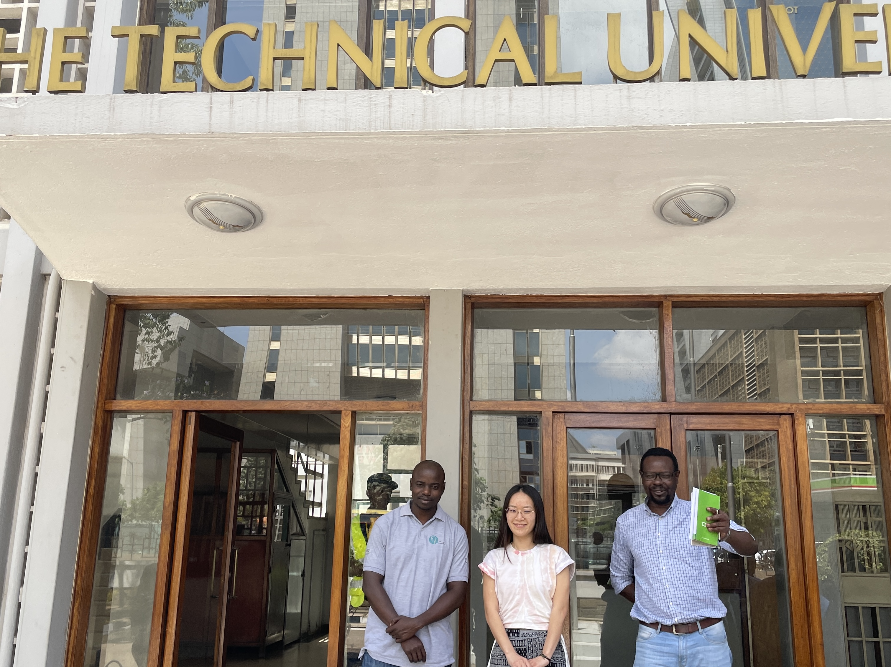
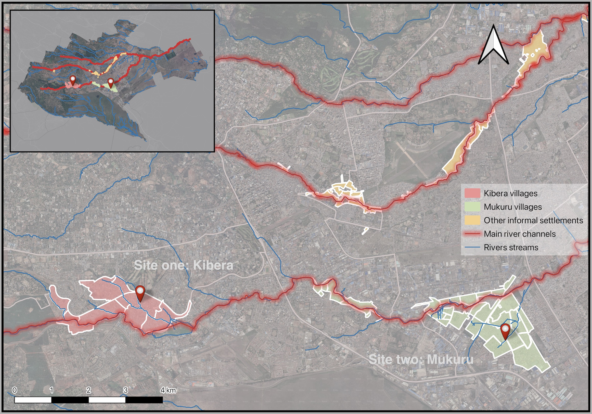
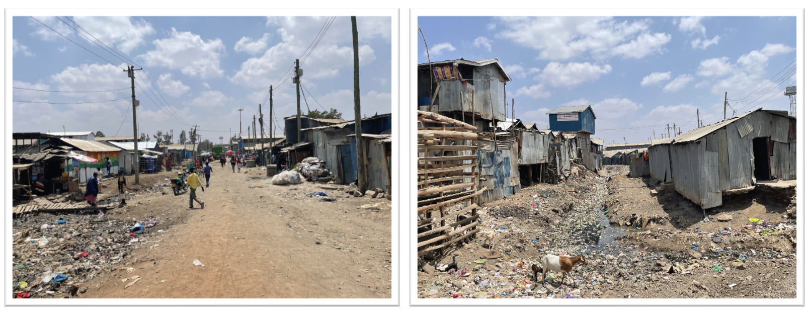
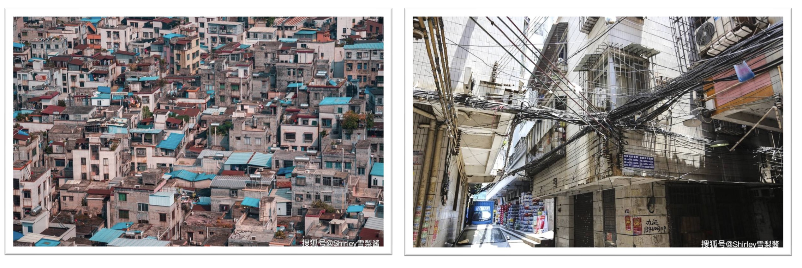
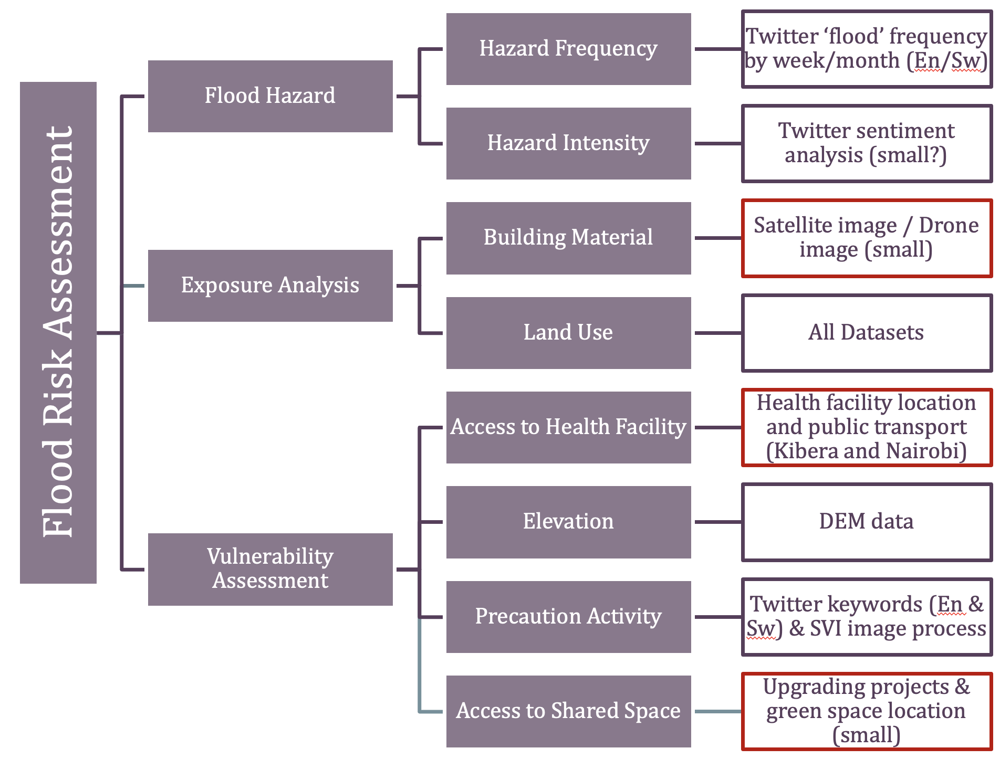
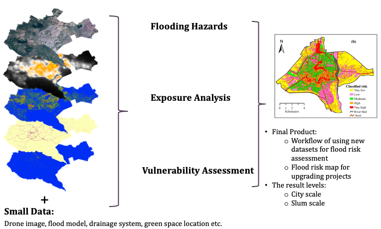
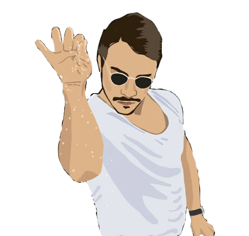

```{r setup, include=FALSE}
options(htmltools.dir.version = FALSE)
```

```{r xaringan-all, echo=FALSE}
library(countdown)
library(xaringan)
library(xaringanExtra)
library(knitr)


hook_source <- knitr::knit_hooks$get('source')
knitr::knit_hooks$set(source = function(x, options) {
  x <- stringr::str_replace(x, "^[[:blank:]]?([^*].+?)[[:blank:]]*#<<[[:blank:]]*$", "*\\1")
  hook_source(x, options)
})

xaringanExtra::use_tachyons()
xaringanExtra::use_broadcast()
xaringanExtra::use_freezeframe()
xaringanExtra::use_scribble()
#xaringanExtra::use_slide_tone()
xaringanExtra::use_search(show_icon = TRUE, auto_search = FALSE)
xaringanExtra::use_freezeframe()
xaringanExtra::use_clipboard()
xaringanExtra::use_tile_view()
xaringanExtra::use_panelset()
xaringanExtra::use_editable(expires = 1)
xaringanExtra::use_fit_screen()
xaringanExtra::use_extra_styles(
  hover_code_line = TRUE,         
  mute_unhighlighted_code = TRUE  
)

```

class: center, title-slide, middle

background-image: url("Image/CASA_BG.png")
background-size: cover
background-position: center


<style>
.title-slide .remark-slide-number {
  display: none;
}
</style>


```{r load_packages, message=FALSE, warning=FALSE, include=FALSE}
library(fontawesome)
library(tidyverse)
library(kableExtra)
library(readxl)
library(fs)
library(here)
```

 
```{r, load_refs, include=FALSE, cache=FALSE}
library(RefManageR)
BibOptions(check.entries = FALSE,
           bib.style = "authoryear",
           cite.style = "authoryear",
           style = "markdown",
           hyperlink = TRUE,
           dashed = FALSE,
           no.print.fields=c("doi", "urldate", "issn"))
myBib <- ReadBib("references.bib", check = FALSE)
```    

# Group Meeting 

### Field Trip Update

### 06/03/2023 (updated: `r format(Sys.time(), "%d/%m/%Y")`)

`r fa("paper-plane", fill = "#562457")` [wenlan.zhang.21@ucl.ac.uk](mailto:wenlan.zhang.21@ucl.ac.uk)
`r fa("twitter", fill = "#562457")` [zhangwenlan54](https://twitter.com/zhangwenlan54)
`r fa("github", fill = "#562457")` [wenlanzhang](https://github.com/wenlanzhang)
`r fa("location-dot", fill = "#562457")` [Centre for Advanced Spatial Analysis, UCL](https://www.ucl.ac.uk/bartlett/casa/)
<!-- `r fa("file-pdf", fill = "#562457")` [PDF presentation](https://github.com/wenlanzhang/Presentation/blob/main/GroupPre_FieldTrip.pdf)-->

<a href="https://github.com/wenlanzhang" class="github-corner" aria-label="View source on GitHub"><svg width="80" height="80" viewBox="0 0 250 250" style="fill:#fff; color:#151513; position: absolute; top: 0; border: 0; left: 0; transform: scale(-1, 1);" aria-hidden="true"><path d="M0,0 L115,115 L130,115 L142,142 L250,250 L250,0 Z"></path><path d="M128.3,109.0 C113.8,99.7 119.0,89.6 119.0,89.6 C122.0,82.7 120.5,78.6 120.5,78.6 C119.2,72.0 123.4,76.3 123.4,76.3 C127.3,80.9 125.5,87.3 125.5,87.3 C122.9,97.6 130.6,101.9 134.4,103.2" fill="currentColor" style="transform-origin: 130px 106px;" class="octo-arm"></path><path d="M115.0,115.0 C114.9,115.1 118.7,116.5 119.8,115.4 L133.7,101.6 C136.9,99.2 139.9,98.4 142.2,98.6 C133.8,88.0 127.5,74.4 143.8,58.0 C148.5,53.4 154.0,51.2 159.7,51.0 C160.3,49.4 163.2,43.6 171.4,40.1 C171.4,40.1 176.1,42.5 178.8,56.2 C183.1,58.6 187.2,61.8 190.9,65.4 C194.5,69.0 197.7,73.2 200.1,77.6 C213.8,80.2 216.3,84.9 216.3,84.9 C212.7,93.1 206.9,96.0 205.4,96.6 C205.1,102.4 203.0,107.8 198.3,112.5 C181.9,128.9 168.3,122.5 157.7,114.1 C157.9,116.9 156.7,120.9 152.7,124.9 L141.0,136.5 C139.8,137.7 141.6,141.9 141.8,141.8 Z" fill="currentColor" class="octo-body"></path></svg></a><style>.github-corner:hover .octo-arm{animation:octocat-wave 560ms ease-in-out}@keyframes octocat-wave{0%,100%{transform:rotate(0)}20%,60%{transform:rotate(-25deg)}40%,80%{transform:rotate(10deg)}}@media (max-width:500px){.github-corner:hover .octo-arm{animation:none}.github-corner .octo-arm{animation:octocat-wave 560ms ease-in-out}}</style>

---

```{r, echo=FALSE}
xaringanExtra::use_progress_bar(color = "#0051BA", location = "bottom")
```

.pull-left[
# Contents

## Background 

## Fieldtrip Plan

## Observation

## Data Collected

## Reflection

]

.pull-right[
```{r echo=FALSE, out.width='100%', fig.align='left'}
knitr::include_graphics('Image/content.JPG')
```
]


```{r xaringan-logo, echo=FALSE}
xaringanExtra::use_logo(
  image_url = "Image/casa_logo.jpg",
  width = "50px",
  position = xaringanExtra::css_position(top = "1em", right = "2em"))
```
---

# Background - Context

```{r echo=FALSE, out.width='95%', fig.align='center'}

```

* Improving Data Justice for Flood Risk Assessment in Nairobi, Kenya

---

class: inverse, center, middle

# Fun question: 
# How many seasons do places near the Equator have?

---

# Background - Case study

```{r echo=FALSE, out.width='60%', fig.align='center'}
knitr::include_graphics('Image/Nairobi0328.png')
```

Nairobi, Kenya
  * Rainy season   
     - Long rainy season: April to June
     - Short rainy season: November to mid-December
  * Drought season 
     - July to October
     - December to March

---

# Fieldtrip design

### Local collaborator: Kounkuey Design Initiative (KDI)

  * A community development NGO
  * Projects in Nairobi - Slum upgrading:  
  internet accessibility, public space, nature-based solutions, drainage installation
  * Local experts hired
  residents still live in Kibrea

.pull-left[
```{r echo=FALSE, out.width='100%', fig.align='center'}
knitr::include_graphics('Image/Workshop.JPG')
```
]

.pull-right[
```{r echo=FALSE, out.width='100%', fig.align='center'}
knitr::include_graphics('Image/Allan.JPG')
```
]

---

# Fieldtrip design (spontaneous meetup)

.pull-left[
```{r echo=FALSE, out.width='100%', fig.align='center'}
knitr::include_graphics('Image/UN.JPG')
```

#### UN-Habitat:

  * Nairobi Rivers Basin Rehabilitation and Restoration Program
  
]

.pull-right[
```{r echo=FALSE, out.width='100%', fig.align='center'}

```

#### Technical University of Kenya	

  * Participatory flood modelling for negotiation and planning in urban informal settlements
]

Thanks to **Dr.Faith Taylor** and **Mr.Mark Ojal** for the connection

---

# Observations - 2 Slums location
```{r echo=FALSE, out.width='98%', fig.align='center'}

```

---

# Observations - 2 Slums

.pull-left[
```{r echo=FALSE, out.width='100%'}
knitr::include_graphics('Image/river.JPG')
```

**Kibera**

* Largest urban slum in Africa
* River: Ngong River, Nairobi Dam
* Home to approximately 250,000 people across an area of just 2.5 kilometres
]

.pull-right[
```{r echo=FALSE, out.width='100%', fig.align='center'}
knitr::include_graphics("Image/river2.JPG")
```

**Mukuru**

* One of the largest slums in Nairobi
* River: Ngong River
* Situated on waste lands in the industrial area
]

---

# Observations - Slums == Urban Village

.panelset[

.panel[.panel-name[Africa Slums]

```{r echo=FALSE, out.width='100%', fig.align='center'}

```

]

.panel[.panel-name[Chinese Urban Village]

```{r echo=FALSE, out.width='110%', fig.align='center'}

```

]

.panel[.panel-name[Similarities]

  * High densities 

  * House low-income populations
  
  * Strong community connections

]

.panel[.panel-name[Differences]

**Slums**

  * History reason: Colonisation 
  * Location: outskirts of cities, far from the central business district (?)
  * Housing materials: corrugated iron, cardboard, and plastic sheeting
  * Infra and services: lack access to: clean water, sanitation, and healthcare
  
**Urban Villages**  

  * History reason: Rapid urbanization (temperature and land ownership?)
  * Location: city centre or with convenient transportation links
  * Housing structure: old and new buildings
  * Infra and services:  better access although may lacking in some areas.

]
]

---

# Observations - Slums characteristics

.pull-left[
```{r echo=FALSE, out.width='100%'}
knitr::include_graphics('Image/InBridge.JPG')
```

**Sewage system**

* Illegal/Legal ?
]

.pull-right[
```{r echo=FALSE, out.width='100%', fig.align='center'}
knitr::include_graphics("Image/Animal.JPG")
```

**Animals**

* can be used for identifying informal area from SVI
]

---

# Observations - Slums characteristics

.pull-left[
```{r echo=FALSE, out.width='100%'}
knitr::include_graphics('Image/IScommercial.JPG')
```
]

.pull-right[
```{r echo=FALSE, out.width='100%', fig.align='center'}
knitr::include_graphics("Image/Market.JPG")
```
]

**Commercial activities**

* Safaricom payment is highly used even in slum
* Umbrella can be used for identifying informal trades from SVI
* High buildings within slums might be considered to be more risky (?)

---

# Observations - Flooding Season

.pull-left[
```{r echo=FALSE, out.width='100%'}
knitr::include_graphics('Image/KDI/flood1.JPG')
```
]

.pull-right[
```{r echo=FALSE, out.width='100%', fig.align='center'}
knitr::include_graphics("Image/KDI/flood2.JPG")
```
]

* Flood duration:   
rain for 2-3 hours, block for 10-30 mins , longer in the evening, 2-3 times per week   
* Working time: Monday – Saturday 3-5am to 8pm
* Commuting: Walking, Matatus, boda-boda
* Only way to someone's house  

@KDI

---

# Observations - Flooding Season

.pull-left[
```{r echo=FALSE, out.width='100%'}
knitr::include_graphics('Image/KDI/flood3.JPG')
```
]

.pull-right[
```{r echo=FALSE, out.width='100%', fig.align='center'}
knitr::include_graphics("Image/KDI/flood4.JPG")
```
]

### Why is the sign?

---

# Observations - FLooding Cause

.pull-left[
```{r echo=FALSE, out.width='100%', fig.align='center'}

```
]

.pull-right[

### Rainy season

### Industrial area

### Illegal dumping

### Government ignorance
]

---

# Observations - Trust transects

```{r echo=FALSE, out.width='100%', fig.align='center'}
knitr::include_graphics("Image/Trust.png")
```

* Key word  from 'Messy maps: Qualitative GIS representations of resilience'

---

# KDI Projects - Public Space Projects  

.pull-left[

```{r echo=FALSE, out.width='100%', fig.align='center'}
knitr::include_graphics("Image/flag.JPG")
```

**Sanitize facility**

* Shared space for social activity
* Washing area 
* Lower price for clean water
* Flag for flood information dissemination
]

.pull-right[
```{r echo=FALSE, out.width='100%', fig.align='center'}
knitr::include_graphics("Image/PS2.JPG")
```

**Meeting room**

* WiFi access
* Meeting room for SMEs
* Sanitize facility

]

---

# KDI Projects - Flood Prevention NBS Projects

.pull-left[

```{r echo=FALSE, out.width='100%', fig.align='center'}
knitr::include_graphics("Image/Gabion.JPG")
```

**Gabion**
* Flood prevention
]

.pull-right[
```{r echo=FALSE, out.width='100%', fig.align='center'}
knitr::include_graphics("Image/Drainage.JPG")
```

**Drainage**
* Flood prevention
]

---

# KDI Projects - School Upgrading

.pull-left[

```{r echo=FALSE, out.width='100%', fig.align='center'}
knitr::include_graphics("Image/PSchool.JPG")
```
]

.pull-right[
```{r echo=FALSE, out.width='100%', fig.align='center'}
knitr::include_graphics("Image/PSchool1.JPG")
```
]

**School Upgrading**

* refurbishing classroom
* planting
* residents lifting

---

# Data Collected

- City Raster: Flood Risk, Precipitation, SRTM, Vegetation Cover
  
- City Vector: Building Footprint, Dumpsites, Informal Settlements, Landuse, 
  River&Channel, Neighborhoods, Parks, Population, Railway, Roads, Schools, Sewer
  
- River 500m Buffer Vector: Universities, Rural Agriculture, Population, 
  Ongoing Projects, Landuse, informal settlements, Dumpsites etc
  
- Informal Settlements Raster: Orthomosaic, Flood Extent

- Informal Settlements Vector: TBC

---

# Reflections

1. City, river and informal settlements scale analysis

    - City: green space 
    - River: distance to the river
    - Informal settlements: public space
    - Generic: elevation, awareness, access to health facility
    
2. Flood identification

    - RS: satellite image, drone image
    - SVI: damaged building, drainage, 
    - Social media posts: flood, rain, waste, river traffic, bridge, flag, gabion, cholera
    - Hydraulic data: Precipitation, ground water level 
  
3. Informal settlements identification

    - Open Building/OSM: building footprint

4. Flood cause

    - Rain flood
    - River flood

---

# Reflections - Indicators for FRA

```{r echo=FALSE, out.width='90%', fig.align='center'}

```

---

# Reflections - Expected Result 

```{r echo=FALSE, out.width='100%', fig.align='center'}

```

---

class: inverse, center, middle

# Fun question: 
# How many seasons do places near the Equator have?

## 2 Winter and 2 Summer

---

class: center, middle

## Welcome: questions, challenges, comments, and suggestions 

```{r echo=FALSE, out.width='40%', fig.align='center'}

```

Thanks to **Chen** for making this trip possible  
Thanks to **Qili** for her intermediate feedback  

---

class: inverse, center, middle

# Holiday pics if people are interested
## 又名：张文澜的小学生春游日记 

---

```{r echo=FALSE, out.width='100%', fig.align='center'}
knitr::include_graphics("Image/Holi/Ineuality.JPG")
```

---

```{r echo=FALSE, out.width='100%', fig.align='center'}
knitr::include_graphics("Image/Holi/Culture.JPG")
```

---

```{r echo=FALSE, out.width='100%', fig.align='center'}
knitr::include_graphics("Image/Holi/Animal.JPG")
```

---

```{r echo=FALSE, out.width='100%', fig.align='center'}
knitr::include_graphics("Image/Holi/SeaAnimal.JPG")
```

---

<!--
```{r include=FALSE}
library(renderthis)
renderthis::to_pdf("index.html")
```
--->

